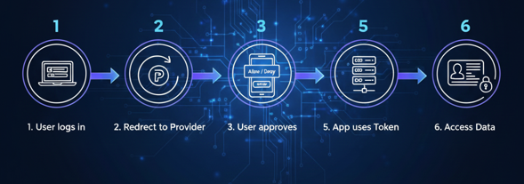

# Informative Notes: OAuth

## Table of Contents
1. [Disclaimer](#disclaimer)
2. [What is OAuth?](#what-is-oauth)
3. [How OAuth Works](#how-oauth-works)
4. [Why OAuth is Needed](#why-oauth-is-needed)
5. [Real-World Example](#real-world-example)
6. [OAuth Tokens Explained](#oauth-tokens-explained)
7. [Why OAuth is Important](#why-oauth-is-important)
8. [Advantages of OAuth](#advantages-of-oauth)
9. [Disadvantages of OAuth](#disadvantages-of-oauth)
10. [Key Reminder](#key-reminder)
11. [Where You See OAuth Every Day](#where-you-see-oauth-every-day)
12. [Final Thought](#final-thought)

---

## Disclaimer
These notes are prepared for educational purposes based on publicly available concepts.  
They are intended as personal study notes.

---

## What is OAuth?
OAuth is a **secure authorization mechanism** that allows users to grant limited access to their resources to third-party applications **without revealing their credentials**.  

Instead of saying:

> “Here is my username and password, please take care of it”

You’re saying:

> “You can access *only this much* of my data, for *this purpose*, for *this amount of time*.”

---

## How OAuth Works

1. User logs into a **trusted provider** (Google, Facebook, GitHub, etc.)  
2. Provider asks for **permission**:  
   > “Do you allow this app to access your profile?”  
3. User grants permission  
4. Provider issues an **Access Token**  
5. App uses the token to access **only allowed data**  

**Important:** The password is **never shared**.

---

## Why OAuth is Needed

### ❌ Without OAuth:
- Users give **username & password** to third-party apps  
- High risk if app is compromised  
- No control over what data is accessed  

### ✅ With OAuth:
- Password is **never shared**  
- Access is **limited & controlled**  
- Access can be **revoked anytime**

---

## Real-World Example
You want to use a new website or app, and it asks you to **“Login with Google”**.  
You click the button, choose your Google account, allow access… and you’re logged in.  

You never typed your Google password into that website.  
That’s OAuth working behind the scenes.  

---

## OAuth Tokens Explained

### 🔑 Access Token
- Acts like a **permission slip**  
- Proves the app can access your data  
- Does **not reveal your password**  
- Expires after some time  
- Used every time the app calls the API  

### 🔄 Refresh Token
- Used to **get a new access token**  
- More secure (stored server-side)  

---

## Why OAuth is Important
- Improves security  
- Prevents password sharing  
- Provides fine-grained access control  
- Token expiration reduces risk  
- Industry standard  

Used by:  
- Google  
- Facebook  
- Microsoft  
- GitHub  
- Cloud APIs  

---

## Advantages of OAuth
✅ Very secure  
✅ Passwords never shared  
✅ Scope-based permission  
✅ Token expiration & refresh  
✅ Widely supported & standardized  

---

## Disadvantages of OAuth
❌ Complex to implement  
❌ Requires trusted identity provider  
❌ Multiple redirects  
❌ Harder to debug  

---

## Key Reminder
OAuth is mainly about **permission**, not identity.  

It answers:  

> “What is this app allowed to do?”  

Not:  

> “Who are you?”  

---

## Where You See OAuth Every Day
- Login with Google  
- Login with Facebook  
- GitHub integrations  
- Mobile apps  
- Cloud APIs  

You probably use OAuth **every day without realizing it**.

---

## Final Thought
OAuth exists so you **don’t have to trust every app with your password**.  

It lets you share **access**, not **ownership**.  

That’s why OAuth is one of the most important technologies in modern web security 🔐
